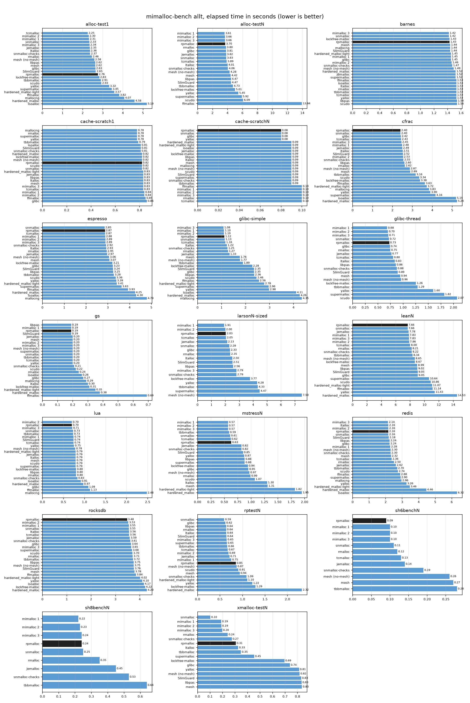
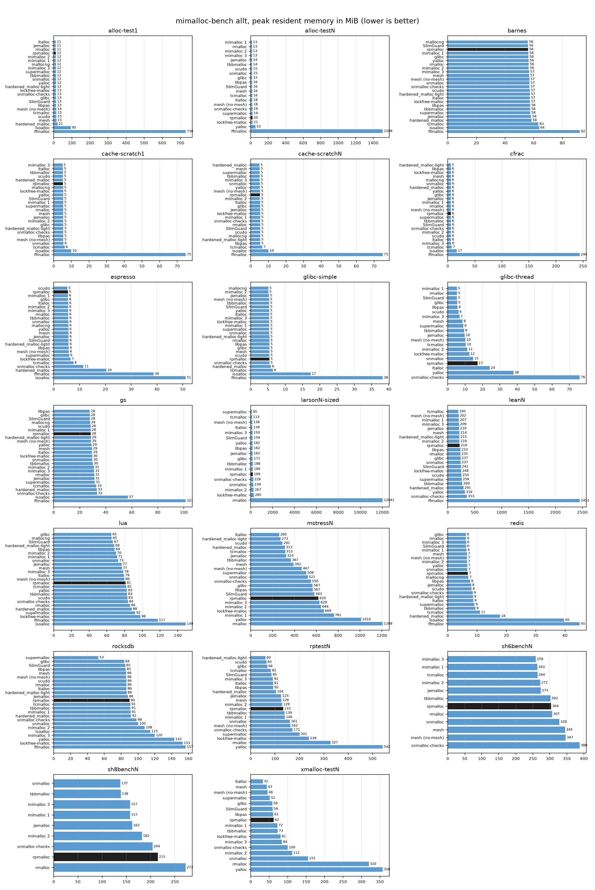

# Benchmarks

These results are produced with the [mimalloc-bench](https://github.com/daanx/mimalloc-bench)
allocator benchmark suite, running its `allt` set of benchmarks across a wide range of
allocators. The raw captured results and the plotting script live in the [benchmark](benchmark)
directory, so the graphs below can be regenerated and extended (see
[Reproducing](#reproducing) below).

All numbers were collected on a single machine:

- 13th Gen Intel Core i7-13800H, 14 cores / 20 threads
- 30 GiB RAM
- Ubuntu 26.04, glibc 2.43
- allocators and benchmarks built with `-march=native`

As with any allocator benchmark, the absolute numbers are specific to this machine and
workload mix and should be read as relative comparisons, not absolute performance figures.

## Per-benchmark results

The `allt` benchmarks are deliberately diverse - real programs, servers and synthetic stress
tests - so they are best read per benchmark rather than reduced to a single aggregate number.
Across the suite rpmalloc sits in the leading throughput group, competitive with snmalloc and
the three mimalloc generations and ahead of jemalloc and tcmalloc, while trading some peak
memory for the larger page geometry and free page retention that drive that throughput. Where
the smaller footprint matters more than peak throughput, the `disable_decommit` configuration
is off by default and unused pages are returned to the OS.

Elapsed wall-clock time per benchmark, lower is better. Allocators more than 4x slower than
rpmalloc on a given benchmark are omitted from that benchmark's chart for readability (the
captured result files contain the complete data).



Peak resident memory per benchmark, lower is better.



## Benchmarks

The `allt` set exercises a mix of real programs and synthetic stress tests:

- **cfrac, espresso, barnes, lean, lua, gs (ghostscript)** - real single and lightly
  threaded programs, dominated by realistic allocation patterns.
- **redis, rocksdb** - real servers driven by their own benchmark clients.
- **larson, mstress, rptest, xmalloc-test, alloc-test, sh6bench, sh8bench, cache-scratch** -
  multithreaded synthetic stress tests covering producer/consumer hand-off, cross-thread
  frees, sharing and contention.
- **glibc-simple, glibc-thread** - the glibc malloc microbenchmarks.

rptest is the same benchmark used for the throughput-versus-threads graph in the
[README](README.md); the suite runs it at a single fixed configuration.

## Allocators

The following allocators were built and run. The `Key` column is the short name used by
mimalloc-bench and in the captured CSV files (the graphs spell out the full names). Versions
are those pinned by mimalloc-bench at the time of the run:

| Key | Allocator | Version |
|-----|-----------|---------|
| rp | rpmalloc | develop |
| mi, mi2, mi3 | mimalloc | 1.8.2, 2.1.2, 3.3.2 |
| je | jemalloc | 5.3.0 |
| tc | tcmalloc (gperftools minimal) | 2.18 |
| sn, sn-sec | snmalloc | 0.7.4 |
| hd | Hoard | 2025-07 |
| tbb | Intel TBB malloc | 2023.0.0 |
| sm | SuperMalloc | master |
| scudo | scudo (LLVM standalone) | main |
| lt | ltalloc | master |
| mng | musl mallocng | master |
| iso | isoalloc | 1.2.5 |
| hm, hml | hardened_malloc, light | 11 |
| sg | SlimGuard | master |
| ff, fg, gd | ffmalloc, FreeGuard, Guarder | master |
| mesh, nomesh | Mesh | master |
| lf | lockfree-malloc | master |
| lp | libpas (WebKit bmalloc) | main |
| yal | yalloc | main |
| rmalloc | rmalloc | master |
| sys | system glibc malloc | 2.43 |

## Reproducing

The graphs are generated from two captured result files in
[benchmark/results](benchmark/results):

- `mimalloc-bench-allt.csv` - the merged `allt` suite results, in the mimalloc-bench
  `benchres.csv` format (`benchmark allocator elapsed rss user sys page-faults page-reclaims`).
- `rptest-threads.csv` - the rptest thread sweep used by the README graph.

To regenerate the `allt` data, build the allocators and benchmarks in a mimalloc-bench
checkout and run the suite from `out/bench`:

```
../../bench.sh sys rp mi mi2 mi3 je tc sn sn-sec hd sm tbb lt iso scudo \
    ff gd hm hml lf lp mesh nomesh mng sg fg yal rmalloc allt
```

The resulting `benchres.csv` replaces `benchmark/results/mimalloc-bench-allt.csv`. Then
regenerate the graphs:

```
python3 benchmark/plot.py
```

`plot.py` requires only `matplotlib`. The graph filtering (the 4x omission rule and dropping
allocators that failed many benchmarks) is applied in the plotting step; the captured CSV
files are always complete and unfiltered.

In the captured `mimalloc-bench-allt.csv` a benchmark that an allocator crashed on is recorded
with a zero or blank elapsed time, or - when the process died after starting but before doing
any real work - with a short elapsed time but zero user and system CPU time (for example
rocksdb under mallocng, which exits immediately with an empty report). `plot.py` treats all of
these as failures rather than as instant (fastest/smallest) results: an allocator that failed
more than two benchmarks is dropped from the graphs entirely (on this run Guarder, Hoard and
FreeGuard - `gd`, `hd`, `fg`), and isolated failures such as mallocng on rocksdb simply leave a
missing data point.
